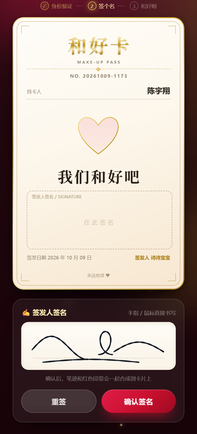

# 和好卡 💌

一个部署在 **GitHub Pages** 上的互动 H5：**她签一张「和好卡」送给你**，
三关流程 —— 签给谁 → 3D 翻卡 → 手写签名 + 盖章生效，最后把生成的卡片图发给你。

卡面上没有条款、没有条件，只有一颗心和一句「我们和好吧」。

纯前端静态站点，**没有任何后端**，构建产物可以直接丢到任何静态托管上。

> 角色说明：**签发人**（签名送卡的人）与**持卡人**（收卡、可以出示此卡的人）。
> 两个名字都集中在 `src/cardSpec.ts`，改一处全站生效。

## 📸 效果预览

| 第一关 · 签给谁 | 第二关 · 卡片与签名 | 第三关 · 成品卡片 |
| :---: | :---: | :---: |
|  |  |  |

---

## ✨ 三关流程

| 关卡 | 内容 |
| --- | --- |
| 第一关 · 签给谁 | 卡片初始为**锁定状态**，自动弹出输入框「**签给谁？**」，她要亲手把收卡人的名字打进来，卡片才解锁。打错了会抖动 + 递进提示，**最多三次就会把答案告诉她**（保证不会卡住）。 |
| 第二关 · 卡片与签名 | 卡片 **3D 翻转入场**，展示烫金卡面（持卡人 / 签发人、两个签名栏、「我们和好吧」）。其中**持卡人签名是预先印好的**，她只需要在底部的手写板上签自己的名字（鼠标 + 手机触摸都支持），提供「重签」「确认签名」。 |
| 第三关 · 做好啦 | 点击「确认签名」后，用 Canvas 把**手写笔迹**和**「已生效」红色印章**合成绘制到卡片上，触发满屏爱心 + 烟花特效，提示「🎉 卡片做好啦！」以及保存方式。 |

卡面内容只有这些，**没有任何条款**：

- 标题「和好卡」+ 编号
- 持卡人：收卡的人
- 一句 **我们和好吧**
- **两个签名栏**：签发人签名（她现场手写）、持卡人签名（预先印上去的）
- 红色「已生效」印章，正好盖在两个签名栏的交界处

> **为什么是两个签名栏？** 纯静态网页没有后台，两个人分别在各自手机上签名是无法汇合的。
> 所以做法是：**先把你的签名采集下来印进卡片**，她再签自己的 —— 两个签名就自然在同一张卡上了，不需要两个人同时在场。

---

## 🧱 技术栈

- **Vue 3**（`<script setup>` + TypeScript）
- **Vite 6**
- **UnoCSS**（`presetUno` + `presetAttributify`）
- **canvas-confetti**（烟花 / 爱心特效）
- 卡面合成、签名板、印章全部用原生 **Canvas 2D** 手写实现，不依赖 html2canvas 之类的截图库

### 几个实现要点

- **笔迹不失真**：签名板把落笔坐标按 **归一化 0~1** 存储，屏幕旋转、窗口缩放后重放不会变形；
  导出时再按卡片签名区的实际宽高（`272 × 86`）重绘，所以「屏幕上写的」和「印在卡片上的」完全一致。
- **笔锋**：根据运笔速度动态改变线宽（写得快更细），更接近真实笔迹。
- **一套版式两处复用**：`src/cardSpec.ts` 是唯一数据源，DOM 卡面（`MakeUpCard.vue`）
  和 Canvas 导出图（`useCardRenderer.ts`）共用同一份坐标与文案，改一处两边同时生效。
- **印章做旧**：印章先画在离屏 canvas 上，用 `destination-out` 随机擦出墨点缺口，
  再以 `multiply` 混合模式盖到卡片上，看起来像真的盖上去的。

---

## 🚀 本地运行

需要 Node.js 18+（推荐 20 / 22）。

```bash
npm install
npm run dev        # 打开 http://localhost:5173
```

打包与本地预览：

```bash
npm run build      # 产物在 dist/
npm run preview    # 预览打包结果 http://localhost:4173
npm run typecheck  # 可选：TypeScript 类型检查
```

> 想直接看成品效果？访问 `?demo=1` 会自动解锁并写上一段示例签名，
> `?demo=2` 会一路跑到「做好啦」的成品图。

---

## 📦 部署到 GitHub Pages（一键）

### 1. 建仓库并推送

在 GitHub 新建一个仓库（**建议用英文名，例如 `hehao-card`**，中文仓库名会让 Pages 地址变成一长串百分号编码），然后：

```bash
cd 和好卡
git init
git add .
git commit -m "feat: 和好卡 H5"
git branch -M main
git remote add origin https://github.com/<你的用户名>/<仓库名>.git
git push -u origin main
```

### 2. 打开 Pages

仓库页面 → **Settings → Pages → Build and deployment → Source** 选择 **GitHub Actions**。

### 3. 等 1 分钟

推送后 `.github/workflows/deploy.yml` 会自动跑：安装依赖 → 构建 → 发布。
在仓库的 **Actions** 标签页可以看到进度，跑完后访问：

```
https://<你的用户名>.github.io/<仓库名>/
```

### 关于路径（重要）

`vite.config.ts` 会自动读取 GitHub Actions 提供的 `GITHUB_REPOSITORY` 环境变量：

- 项目站点 `https://<用户名>.github.io/<仓库名>/` → `base` 自动设为 `/<仓库名>/`
- 用户站点 `<用户名>.github.io` → `base` 自动设为 `/`

本地开发一律用 `/`。**所以不需要手动改任何路径配置。**

---

## 🎨 想改成自己的版本

| 想改什么 | 改哪里 |
| --- | --- |
| 持卡人 / 签发人的名字 | `src/cardSpec.ts` 的 `HOLDER_NAME`（收卡人）、`ISSUER_NAME`（签名送卡人）、`ISSUER_FULL_NAME`（页脚全名）；页头文案在 `src/App.vue` |
| 预先印上去的持卡人签名 | 换掉 `public/holder-sign.png` 即可（用 `public/sign.html` 采集） |
| 卡片标题 / 副标题 / 中间那句话 / 底部小字 | `src/cardSpec.ts` 的 `CARD_TITLE`、`CARD_SUBTITLE`、`CARD_MESSAGE`、`CARD_FOOTNOTE` |
| 第一关的题目、提示语 | `src/components/VerifyDialog.vue` 的 `HINTS` |
| 第一关可以输入哪些名字算对 | `src/cardSpec.ts` 的 `HOLDER_ANSWERS`（大小名、小名都放进去） |
| 卡片标题、副标题、页脚 | `src/cardSpec.ts` 的 `CARD_TITLE` / `CARD_SUBTITLE` / `CARD_FOOTNOTE` |
| 卡面配色、金色、印章红 | `src/cardSpec.ts` 的 `PALETTE`，以及 `src/style.css` 的 CSS 变量与类 |
| 版式坐标（间距、字号、签名框大小） | `src/cardSpec.ts` 的 `LAYOUT`（DOM 与导出图同时生效） |
| 印章文字、大小、角度 | `src/composables/useCardRenderer.ts` 的 `makeStampCanvas` 与 `LAYOUT.stamp` |
| 特效强度 | `src/composables/useConfetti.ts` |

---

## 📁 目录结构

```
和好卡/
├─ .github/workflows/deploy.yml   # GitHub Pages 自动部署
├─ docs/                          # README 用的效果预览图
├─ public/
│  ├─ .nojekyll                   # 让 Pages 不要用 Jekyll 处理产物
│  ├─ holder-sign.png             # 预先印在卡片上的持卡人签名（缺失则那一栏留空）
│  ├─ sign.html                   # 签名采集小工具（手写 → 导出 holder-sign.png）
│  └─ favicon.svg
├─ src/
│  ├─ App.vue                     # 三关流程编排 + 关卡指示 + 烟花画布
│  ├─ main.ts
│  ├─ style.css                   # 全局样式与动画
│  ├─ cardSpec.ts                 # 卡片尺寸/文案/版式（唯一数据源）
│  ├─ components/
│  │  ├─ StageLock.vue            # 第一关：锁定
│  │  ├─ LockedCard.vue           # 卡片背面（锁定卡面）
│  │  ├─ VerifyDialog.vue         # 第一关弹窗（签给谁）
│  │  ├─ StageCard.vue            # 第二关：翻转 + 签名
│  │  ├─ FlipCard.vue             # 3D 翻转容器（自适应缩放）
│  │  ├─ MakeUpCard.vue           # 卡片正面（烫金卡面 + 爱心）
│  │  ├─ SignaturePad.vue         # 手写签名板
│  │  ├─ StageSuccess.vue         # 第三关：成品图
│  │  └─ AppToast.vue
│  └─ composables/
│     ├─ useConfetti.ts           # 烟花 / 爱心特效
│     └─ useCardRenderer.ts       # 卡面 + 笔迹 + 印章 合成
├─ index.html
├─ vite.config.ts                 # 含 Pages base 自动推导
├─ uno.config.ts
└─ tsconfig.json
```

---

## ❓常见问题

**手机上签名时页面会跟着滚动？**
签名板已经设置了 `touch-action: none`，在白色签名区域内滑动不会滚动页面；区域外正常滚动。

**保存下来的图片是 1020 × 1620 的高清图吗？**
是。`renderCard` 默认 3 倍缩放导出，`StageSuccess.vue` 会把 dataURL 转成 Blob 再下载，文件名形如 `和好卡-20260214-0731.png`。

**iOS Safari 上点「保存卡片图片」没反应？**
iOS 对 `download` 属性支持有限，会直接打开图片 —— 此时**长按图片选择「存储到照片」**即可，页面上的提示也是这么写的。

**改了依赖之后 CI 报 `npm ci` 失败？**
本地跑一次 `npm install`，把更新后的 `package-lock.json` 一起提交即可。

**想换成 Hash 路由 / 加更多页面？**
当前是单页无路由，直接在 `App.vue` 里加 stage 即可，不需要改部署配置。

---

祝早日和好 💕
